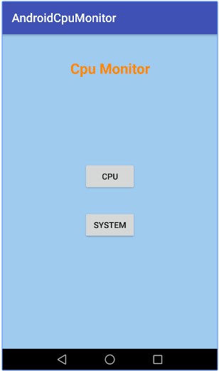
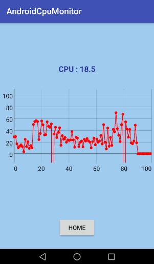
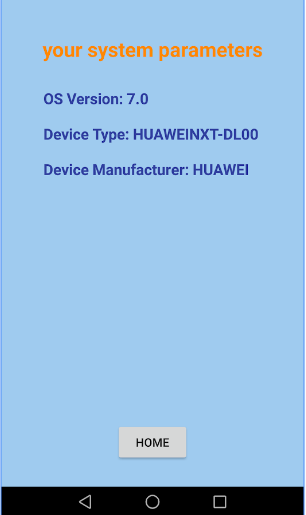

# AndroidCpuMonitor
Android APP for CPU monitor.

# Features

* Completed sys layout and two activity switching.
* Completed basic sys activity.
* Converted to android studio 3.0 project.
* Completed cpu monitor activity & layout.
* Basic cpu usage.
* Repeat textView update task with time delay.
* Draw cpu usage graph by graphview lib.
* Zoom-able cpu usage graph by graphview lib.
* Fixed zero-cpu-usage issue by average.
* Published to google play
* Add cpu temperature.
* Add admob.
* G11n and published as V2.0.

# Google Play 

* pubshed to https://play.google.com/store/apps/details?id=cpumonitor.ybdesire.com.androidcpumonitor

# App Screenshots

